# 导演台 · DirectorDesk

面向 AI 短剧和视频创作的三维预演工具。搭场景、排走位、设计运镜，再导出参考视频。可以手动制作，也可以让内置 AI 助手或外部 MCP Agent 直接操作当前工程。

[下载 Windows 版](https://github.com/mangfufu/director-desk/releases/latest) · [配套 skill](https://github.com/mangfufu/director-desk/releases/latest) · [MIT License](LICENSE)


## 场景与运镜演示

以下动图全部来自软件内置模板的实际摄影机输出，按原速播放，仅降低分辨率和帧率；空房间截取前 8 秒。打开“新建工程 / 模板”即可继续编辑；空白场地也保留供自由搭建。

| 光影舞台 · 冷暖布光、环绕与变焦 | 悬疑长廊 · 希区柯克变焦 |
| --- | --- |
| 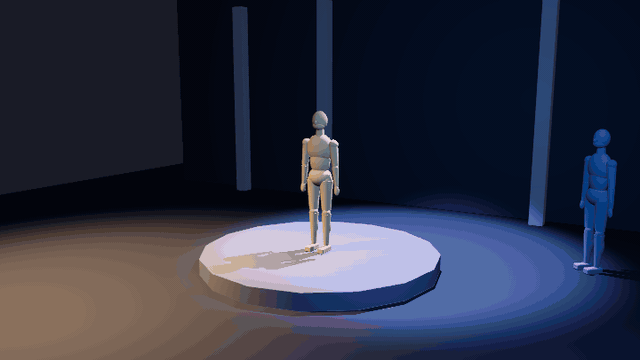 | 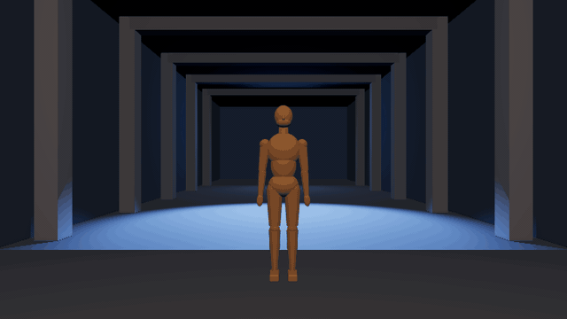 |
| 夜街追逐 · 双人奔跑、手持晃动与广角畸变 | 卧室 · 四人调度、窗光与床头暖灯 |
| 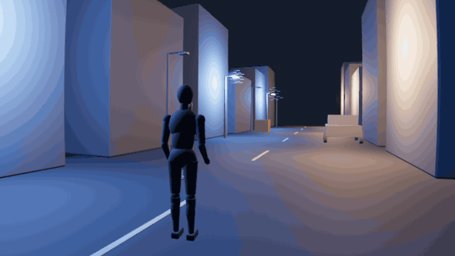 | 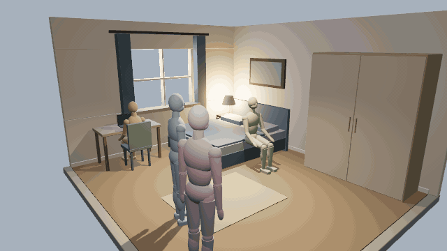 |
| 空房间 · 窗光、木地板，留空布置 | 林地空地 · 树群、步道与双人调度 |
| 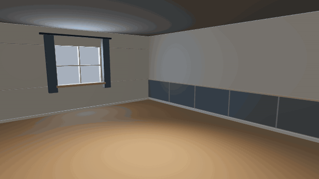 | 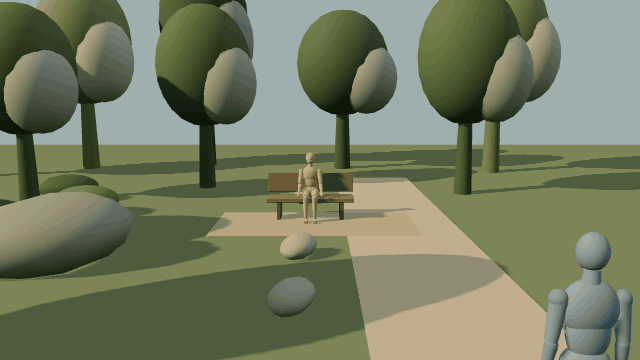 |
| 街道 · 黄昏商铺、人行道与路灯 | 庭院 · 门架、格栅凉棚与台阶平台 |
| 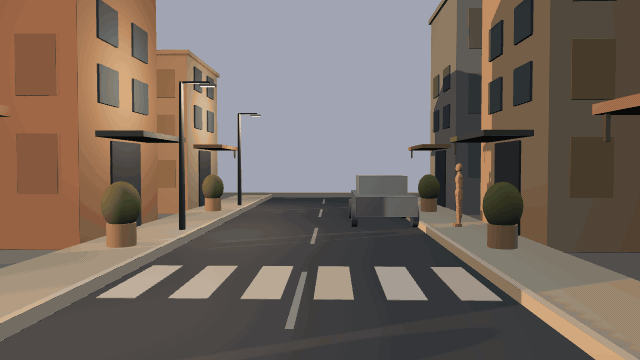 | 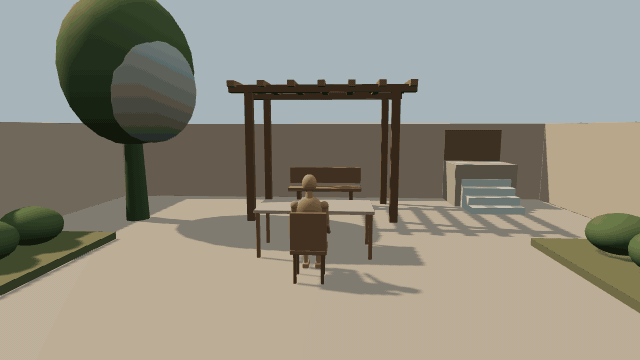 |

<details>
<summary>查看模板选择界面</summary>

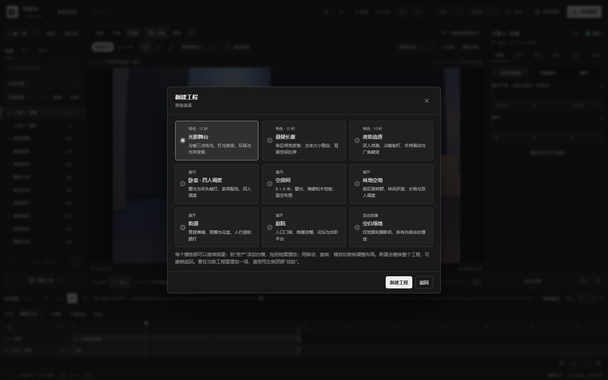

</details>

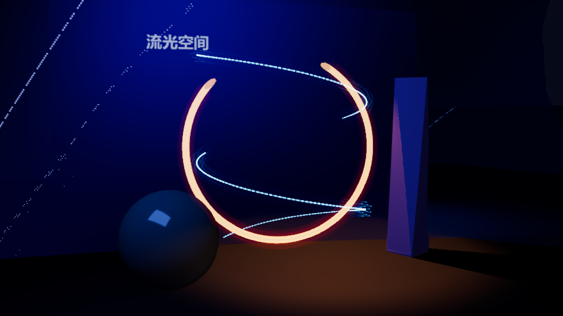

## 能做什么

| 功能 | 用法 |
| --- | --- |
| 白模搭景 | 人物、动物、家具、建筑、道路和道具；调整尺寸、颜色与位置，支持物体吸附 |
| 仅几何体 | 用 16 种几何形状组合、命名、上色，快速表达空间；精细模型模式按需检索资产 |
| 模型与动作导入 | 导入 GLB/glTF、FBX、OBJ 模型；导入骨架动作或收藏模型自带动作，加入用户动作库 |
| 人物调度 | 走位路径、基础动作、群演和手持道具绑定；用键盘操控白模并录制路径 |
| 摄影机 | 同场景真实取景，多机位路径、视线、跟随、POV 和切镜；用连贯运动及“经过／停住”调整节奏，独立设置视线响应 |
| 运镜与镜头效果 | 运镜预设、希区柯克变焦、手持晃动、畸变、景深与对焦 |
| 灯光 | 摆放灯光，调整颜色、强度和阴影，编排环境与灯光关键帧 |
| 图片与视频材质 | 在模型表面贴图或播放视频，裁剪、平铺、调整透明度；也可用聚光灯投影 |
| 抽象元素 | 粒子、光环、丝带、文字、影响区域、形变和局部空间扭曲，支持关键帧 |
| 镜面与门户 | 平面镜像和另一台摄影机的实时画面 |
| 时间轴与曲线 | Ctrl 多选、整组移动与延长、分割、删除和时间范围选择；用曲线控制加速、减速与停顿 |
| 多场戏接拍 | 同工程管理独立戏段，从上一段末帧继承场景与人物状态 |
| 导出 | 单场或批量导出视频、修改输出文件名，保存工程与素材包；可选人物名称标签 |
| AI 协作 | 内置助手和 MCP Agent 按需查询空间、编辑当前工程；选中人物、片段或时间范围后交给 AI 局部调整 |
| 提示词与技能 | 每场保存配套视频提示词；导入、下载和启停自定义技能，支持离线生成工程 |

<details>
<summary>查看灯光与摄影机设置</summary>

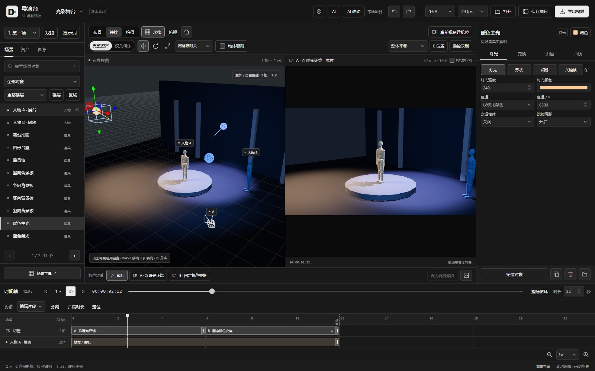

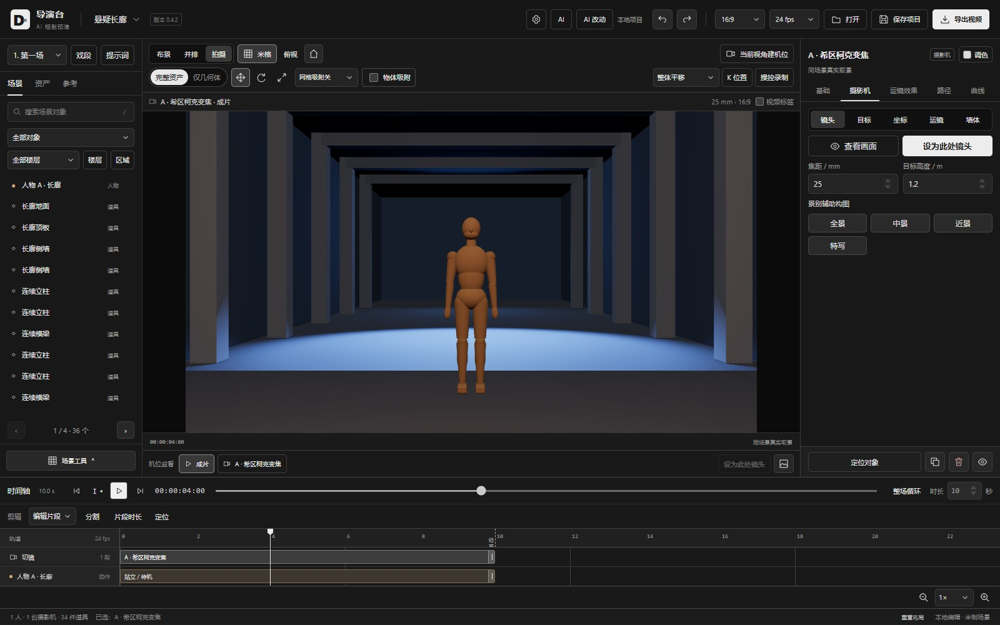

</details>

## 让 AI 直接操作

**内置导演助手**：配置模型渠道，用自然语言提出搭景、走位和镜头调整要求。助手窗口可拖动、缩放和收起，支持执行与讨论模式。

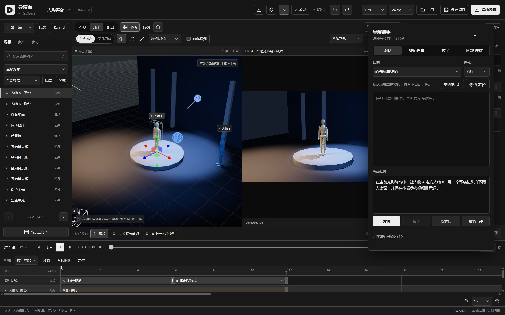

**外部 MCP Agent**：在桌面版的 **AI → MCP 连接** 中启用服务、复制连接配置。让支持 MCP 的 Agent 读取内置 `director_skill`，即可查询指定时刻的位置、理解空间关系并编辑当前工程。成功修改可以定位查看，也可以撤销。 可选择 Claude Code、Claude Desktop、通用 HTTP 或 stdio 配置；stdio 桥接随软件提供，无需另装 Node.js。连接方式见 [MCP 使用说明](skills/director-desk/references/editing.md#连接与旧版软件)。

**自定义技能**：在 **AI → 技能** 导入自己的 SKILL.md 或技能文件夹，也可从公开 GitHub 技能目录下载，自由启用、停用和更新。技能保存在本机，软件升级保留用户技能。

配套 [skill 与离线工具](skills/director-desk/) 随软件提供，也可独立下载；核心说明简明，镜头、媒体、编辑及提示词细节按需读取。没有 MCP 时，Agent 仍可生成可导入网页版本的 .director 工程文件。

## 开始使用

1. 从 [Releases](https://github.com/mangfufu/director-desk/releases/latest) 下载 Windows 安装包或免安装 ZIP。
2. 安装后启动，或完整解压 ZIP 后运行 DirectorDesk.exe。
3. 选择场景模板，摆放人物与道具，在时间轴上编排动作和镜头。
4. 播放预览，导出参考视频；点击戏段旁的“提示词”查看、编辑或导出文案。

齿轮设置中可配置默认工程与导出目录。导出时选择“批量戏段”，勾选需要的戏段并修改文件名，各段沿用自己的画幅、时长和切镜。

“用户动作库”支持预览、命名、搜索和骨架映射，可跨工程使用。已应用动作的源素材随工程保存，删除本机收藏不影响已有工程。

Windows 版启动时检查网站和 GitHub 的最新正式版本，也可手动检查。安装版支持下载后重启安装；免安装版下载新版 ZIP。

## 本地开发

准备 Node.js 24+ 和 npm：

```bash
git clone https://github.com/mangfufu/director-desk.git
cd director-desk
npm ci
npm run dev
```

按终端显示的地址打开网页。要启动 **Electron 桌面开发版**（包含内置 AI、MCP 和桌面文件功能），执行：

```bash
npm run desktop:dev
```

这个命令复用 `desktop:prepare`，先构建网页与独立桌面运行目录，再启动 Electron，无需制作安装包。Windows 和 macOS 使用同一命令。首次使用需安装本机 Chrome，或通过 `CHROME_PATH` 指定 Chrome 路径。

开发版默认将配置、会话和自动恢复数据保存在 `.local/desktop-dev-profile/`，与安装版分开，重启后保留。源码修改后重新运行 `desktop:dev`；此入口不提供热更新。如果没有改代码，只想再次打开已经准备好的版本，可以运行：

```bash
npm run desktop:start
```

可通过 `npm run desktop:dev '--' --remote-debugging-port=9222` 传入 Electron 调试参数；网页开发仍使用支持热更新的 `npm run dev`。

验证后构建网页或 Windows 安装包：

```bash
npm run build
npm run desktop:pack
```

macOS（Apple Silicon）构建 DMG：

```bash
npm run desktop:pack:mac
```

网页产物位于 `dist/`，桌面交付文件位于 `release/`（Windows 为 `DirectorDesk-Setup-<版本>.exe`，macOS 为 `DirectorDesk-<版本>-arm64.dmg`）。桌面构建使用本机 Chrome，可通过 `CHROME_PATH` 指定浏览器。macOS 包未做签名和公证，首次打开如被 Gatekeeper 拦截，请右键点击应用选择“打开”；macOS 版暂不支持应用内自动更新，请从发布页下载新版本。

发布 Windows GitHub Release 时，将构建生成的 `release/latest.yml` 与同版本安装包一起上传，保留文件名。更新客户端按清单校验下载包；缺少清单的历史 Release 仍可检测版本并打开下载页。

从 0.4.8 起支持四段修订号，例如 `0.4.8.1`。三段版本在 `package.json` 的 `version` 与 `shortVersion` 中填写相同值；四段版本使用 `version: "0.4.8+revision.1"`、`shortVersion: "0.4.8.1"`，以兼容 npm 和 Electron。界面、安装包文件名与 GitHub 标签使用四段版本；构建生成的更新清单保留原样即可。更新按四段数字比较，`0.4.8 < 0.4.8.1 < 0.4.9`；早于 0.4.8 的客户端需先升级到 0.4.8。

| 目录 | 内容 |
| --- | --- |
| `src/` | 场景、编辑器、动画、渲染和共用自动化工具 |
| `desktop/` | 桌面入口、AI 协议、MCP 服务和更新客户端 |
| `skills/director-desk/` | 技能说明与离线工程工具 |
| `scripts/`、`tests/` | 构建与验证工具 |

## 许可证

项目自有代码采用 [MIT](LICENSE) 许可证。第三方依赖和动作素材保留各自许可，内置动作来源见 [NOTICE](src/animation/library/NOTICE.txt)。

## 友情链接

[Linux.do](https://linux.do/)
